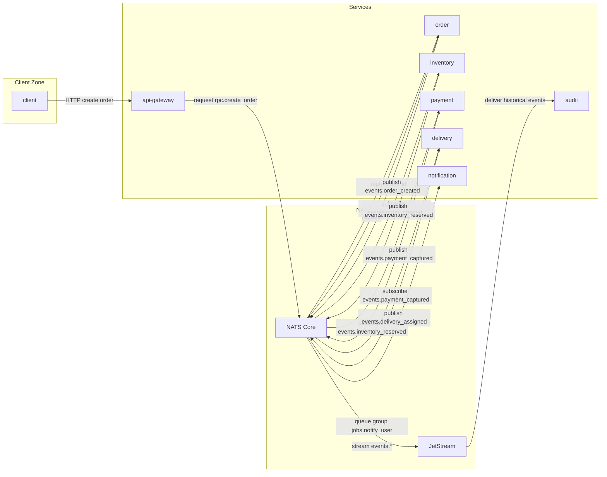

# DeliveryFlow — учебный проект на NATS

DeliveryFlow — мини-система оформления и доставки заказов. Это цельный проект с несколькими сервисами и инфраструктурой, где естественно используются разные паттерны NATS.

## Архитектура

### Сервисы
- `api-gateway` — HTTP API для клиентов (создать заказ, получить статус).
- `order` — создание заказа и публикация доменных событий.
- `inventory` — резервирование товара.
- `payment` — списание/отмена платежа.
- `delivery` — назначение курьера и статусы доставки.
- `notification` — отправка уведомлений (email/push).
- `audit` — запись истории событий.

### Инфраструктура
- **NATS Core** — шина событий и RPC.
- **JetStream** — сохранение истории доменных событий.
- **PostgreSQL** (опционально) — состояние заказов и платежей.

### Зоны взаимодействия
1. **Event Bus (NATS Core)**  
   Обмен доменными событиями между сервисами.

2. **Queue Groups (Tasks)**  
   Фоновые задачи уведомлений и обработки очередей.

3. **Request/Reply (RPC)**  
   Синхронные запросы статусов или проверки наличия.

4. **JetStream (History)**  
   История заказов и возможность реплея событий.

## Диаграмма потоков

## Потоки сообщений

### Pub/Sub (доменные события)
- `order` → `events.order_created` → `inventory`
- `inventory` → `events.inventory_reserved` → `payment`
- `payment` → `events.payment_captured` → `delivery`

### Queue Group (фоновая обработка)
- `events.*` → `jobs.notify_user` → `notification` (несколько воркеров)

### Request/Reply
- `api-gateway` → `rpc.create_order` → `order` → ответ
- `api-gateway` → `rpc.get_order_status` → `order` → ответ

### JetStream
- `events.*` → JetStream → `audit` → сохранение истории

## NATS темы (subjects)

### Events
- `events.order_created`
- `events.inventory_reserved`
- `events.payment_captured`
- `events.delivery_assigned`

### Jobs
- `jobs.notify_user`

### RPC
- `rpc.create_order`
- `rpc.get_order_status`

