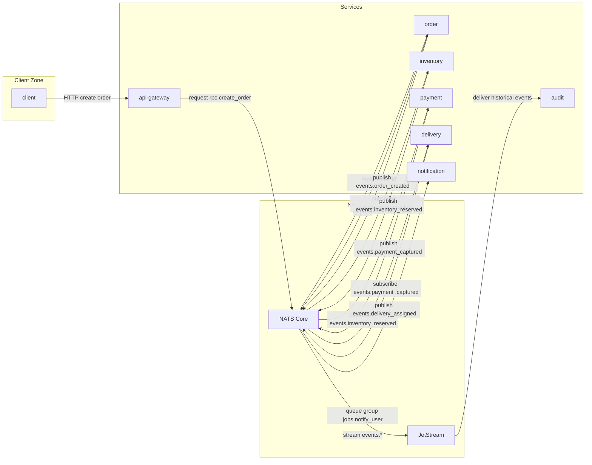

# DeliveryFlow — учебный проект на NATS

DeliveryFlow — мини-система оформления и доставки заказов. Это цельный проект с несколькими сервисами и инфраструктурой, где естественно используются разные паттерны NATS.

## Архитектура

### Сервисы
- `api-gateway` — HTTP API для клиентов (создать заказ, получить статус).
- `order` — создание заказа и публикация доменных событий.
- `inventory` — резервирование товара.
- `payment` — списание/отмена платежа.
- `delivery` — назначение курьера и статусы доставки.
- `notification` — отправка уведомлений (email/push).
- `audit` — запись истории событий.

### Инфраструктура
- **NATS Core** — шина событий и RPC.
- **JetStream** — сохранение истории доменных событий.
- **PostgreSQL** (опционально) — состояние заказов и платежей.

### Зоны взаимодействия
1. **Event Bus (NATS Core)**  
   Обмен доменными событиями между сервисами.

2. **Queue Groups (Tasks)**  
   Фоновые задачи уведомлений и обработки очередей.

3. **Request/Reply (RPC)**  
   Синхронные запросы статусов или проверки наличия.

4. **JetStream (History)**  
   История заказов и возможность реплея событий.

## Диаграмма потоков



## Потоки сообщений

### Pub/Sub (доменные события)
- `order` → `events.order_created` → `inventory`
- `inventory` → `events.inventory_reserved` → `payment`
- `payment` → `events.payment_captured` → `delivery`

### Queue Group (фоновая обработка)
- `events.*` → `jobs.notify_user` → `notification` (несколько воркеров)

### Request/Reply
- `api-gateway` → `rpc.create_order` → `order` → ответ
- `api-gateway` → `rpc.get_order_status` → `order` → ответ

### JetStream
- `events.*` → JetStream → `audit` → сохранение истории

## NATS темы (subjects)

### Events
- `events.order_created`
- `events.inventory_reserved`
- `events.payment_captured`
- `events.delivery_assigned`

### Jobs
- `jobs.notify_user`

### RPC
- `rpc.create_order`
- `rpc.get_order_status`

## Api-gateway сервис

`api-gateway` предоставляет HTTP API для клиентов и проксирует запросы в `order`
через NATS Request/Reply. Сервис не хранит состояние, только валидирует входные
данные и отдает ответы от доменных сервисов.

### Требования
- Go 1.25+
- NATS Core (`nats://localhost:4222` по умолчанию)

### Конфигурация (env)
- `HTTP_ADDR` — адрес HTTP сервера (по умолчанию `:8080`)
- `NATS_URL` — адрес NATS (по умолчанию `nats_rpc:4222`)

### Эндпоинты

#### `POST /api/v1/orders`
Создать заказ.

Request body:
```json
{
  "user_id": "string",
  "items": [
    { "sku": "string", "qty": 1 }
  ],
  "address": "string",
  "payment_method": "card"
}
```

Response 201:
```json
{
  "order_id": "string",
  "status": "created"
}
```

Ошибки:
- 400 — некорректный JSON или невалидные поля
- 504 — таймаут запроса к `order` через NATS
- 502 — `order` вернул ошибку

#### `GET /api/v1/orders/{id}`
Получить статус заказа.

Response 200:
```json
{
  "order_id": "string",
  "status": "created|reserved|paid|assigned|delivered|cancelled",
  "updated_at": "2026-01-30T12:00:00Z"
}
```

Ошибки:
- 400 — некорректный `id`
- 404 — заказ не найден
- 504 — таймаут запроса к `order` через NATS
- 502 — `order` вернул ошибку

#### `GET /api/v1/health`
Быстрый healthcheck (без внешних зависимостей). Ответ: `200 OK`.

#### `GET /ready`
Readiness-проверка: NATS подключен и доступен. Ответ: `200 OK` или `503`.

### NATS взаимодействия
- `POST /api/v1/orders` → `rpc.create_order` (request/reply)
- `GET /api/v1/orders/{id}` → `rpc.get_order_status` (request/reply)

### Запуск
```bash
export NATS_URL="nats_rpc:4222"
export HTTP_ADDR=":8080"
go run ./cmd
```
